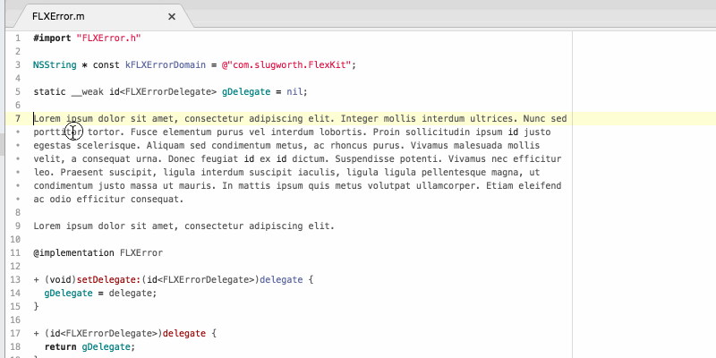

# comment-utils
An Atom package that supports quick reflowing and reformatting of C++ style comments.
Invoking *ctrl-c /* repeatedly on a comment selection cycles between the following comment styles:

## Double-slash
<pre>
// The quick brown fox jumped over the lazy dog. The quick brown fox jumped over
// the lazy dog. The quick brown fox jumped over the lazy dog. The quick brown
// fox jumped over the lazy dog.
</pre>

## Google Objective-C
<pre>
/** The quick brown fox jumped over the lazy dog. The quick brown fox jumped
 *  over the lazy dog. The quick brown fox jumped over the lazy dog. The quick
 *  brown fox jumped over the lazy dog.
 */
</pre>

## Javadoc
<pre>
/**
 * The quick brown fox jumped over the lazy dog. The quick brown fox jumped over
 * the lazy dog. The quick brown fox jumped over the lazy dog. The quick brown
 * fox jumped over the lazy dog.
 */
</pre>

## Partial Objective-C

<pre>
 *  The quick brown fox jumped over the lazy dog. The quick brown fox jumped
 *  over the lazy dog. The quick brown fox jumped over the lazy dog. The quick
 *  brown fox jumped over the lazy dog.
</pre>

## Partial Javadoc
<pre>
 * The quick brown fox jumped over the lazy dog. The quick brown fox jumped over
 * the lazy dog. The quick brown fox jumped over the lazy dog. The quick brown
 * fox jumped over the lazy dog.
</pre>

Doxygen style prefixes of the form *@c token* are not broken at end-of-line boundaries.

The comments are automatically reflowed to fit preferred line length and are indentation-preserving.

Single line comments are formatted like this:

<pre>// The quick brown fox jumped over the lazy dog.</pre>
<pre>/** The quick brown fox jumped over the lazy dog. */</pre>
<pre>/* The quick brown fox jumped over the lazy dog. */</pre>

## In action

## TODO:
  - [ ] Add tests
  - [ ] Make available to Atom's package manager

## Thanks
  - [PegJS](https://pegjs.org/) is amazing!!!
